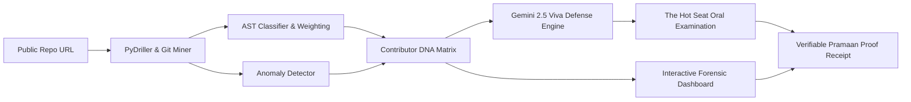

<div align="center">

# ⚖️ Pramaan AI (प्रमाण AI)
### *Har Code Ka Pramaan. Autonomous Code Forensics & Viva Defense Engine.*

[](https://unstop.com)
[](https://hoollow.com)
[](#)
[](https://python.org)
[](https://fastapi.tiangolo.com)
[](https://nextjs.org)
[](https://ai.google.dev)

<p align="center">
  <b>Tired of freeloaders claiming equal credit in group projects? Tired of 4,000-line 3 AM ChatGPT dumps?</b><br/>
  Pramaan AI combines <b>deep git forensics</b>, <b>AST semantic weighting</b>, and an <b>autonomous line-targeted AI viva examiner</b> to turn messy repositories into verifiable, indisputable proof of work.
</p>

[System Architecture](#-system-architecture) •
[Core Features](#-core-interactive-features) •
[Quickstart](#-quickstart-guide) •
[Project Specs](#-project-specifications--documentation) •
[Hackathon Pitch](#-pitch--hoollow-alignment)

---

</div>

## 📌 The Freeloader & AI-Dump Dilemma

In university capstones and hackathons across the world:
- **1 student writes the core logic** while 3 teammates tweak CSS or copy-paste boilerplate, yet all claim equal 10/10 grades.
- **AI Dumpers** paste thousands of lines from ChatGPT or clone public tutorials 5 hours before submission without understanding a single function.
- **Evaluators and judges have 3 minutes** per team and cannot manually inspect 200 commits, git blames, or line-by-line diffs.

**Pramaan AI solves this completely.**

---

## ⚡ System Architecture



---

## 💎 Core Interactive Features

### 1. 🔍 "The Git Crime Scene" — Timeline Scrubber
* Scrub through the project's timeline like a DVR tape.
* Visually spot normal incremental commits vs violent red shockwaves indicating massive copy-paste dumps at 3 AM.

### 2. 🕸️ Contributor DNA & Proof-of-Work Radar
* 5-axis dynamic radar chart comparing:
  - **Algorithmic Density (Tier 3 Core Logic vs Tier 1 Boilerplate)**
  - **Debugging Churn (Deletions / Modifications)**
  - **Commit Cadence & Atomicity**
  - **AST Cyclomatic Complexity**
  - **Viva Defense Mastery**

### 3. 🎙️ "The Hot Seat" — Autonomous Viva Defense Terminal
* AI examiner targets the exact lines and commits each student claims to have written.
* Evaluates audio or typed responses against actual code realities to expose uncomprehending copy-pasters.

### 4. 🧾 The Verifiable Pramaan Proof-of-Work Receipt
* A tactile, Hoollow-inspired digital thermal receipt with cryptographic hash, contributor authenticity grades, and QR code verification.

---

## 📚 Project Specifications & Documentation

Every aspect of Pramaan AI is strictly specified to enable deterministic, hallucination-free development:

| Document | Purpose |
| :--- | :--- |
| **[MASTER_CONTEXT.md](file:///c:/Users/rohit/OneDrive/Desktop/Pramaan%20AI/docs/MASTER_CONTEXT.md)** | Single universal prompt & architectural context for any AI session. |
| **[WORKFLOW.md](file:///c:/Users/rohit/OneDrive/Desktop/Pramaan%20AI/docs/WORKFLOW.md)** | End-to-end data pipeline, execution steps, and milestones. |
| **[DESIGN_SPEC.md](file:///c:/Users/rohit/OneDrive/Desktop/Pramaan%20AI/docs/DESIGN_SPEC.md)** | Cinematic 5-Act forensic investigation UI/UX — layouts, animations, tokens. |
| **[FRONTEND_PAGES_SPEC.md](file:///c:/Users/rohit/OneDrive/Desktop/Pramaan%20AI/docs/FRONTEND_PAGES_SPEC.md)** | Page-by-page Next.js implementation guide — state, API calls, components. |
| **[BACKEND_SPEC.md](file:///c:/Users/rohit/OneDrive/Desktop/Pramaan%20AI/docs/BACKEND_SPEC.md)** | PyDriller algorithms, AST weight formulas, DB schemas, and FastAPI endpoints. |
| **[VIVA_ENGINE_SPEC.md](file:///c:/Users/rohit/OneDrive/Desktop/Pramaan%20AI/docs/VIVA_ENGINE_SPEC.md)** | Gemini prompt templates, line-grounding logic, and grading rubrics. |
| **[PROMPT_LIBRARY.md](file:///c:/Users/rohit/OneDrive/Desktop/Pramaan%20AI/docs/PROMPT_LIBRARY.md)** | Every exact Gemini prompt template — copy-paste ready. |
| **[SAMPLE_API_DATA.md](file:///c:/Users/rohit/OneDrive/Desktop/Pramaan%20AI/docs/SAMPLE_API_DATA.md)** | Mock API responses for parallel frontend development. |
| **[ENV_AND_SETUP.md](file:///c:/Users/rohit/OneDrive/Desktop/Pramaan%20AI/docs/ENV_AND_SETUP.md)** | Environment variables, installation steps, deployment guide. |
| **[ERROR_HANDLING.md](file:///c:/Users/rohit/OneDrive/Desktop/Pramaan%20AI/docs/ERROR_HANDLING.md)** | Every error state, graceful degradation, frontend error UI. |
| **[DEMO_REPO_SPEC.md](file:///c:/Users/rohit/OneDrive/Desktop/Pramaan%20AI/docs/DEMO_REPO_SPEC.md)** | Scripted demo repo with 3 contributor archetypes. |
| **[TESTING_SPEC.md](file:///c:/Users/rohit/OneDrive/Desktop/Pramaan%20AI/docs/TESTING_SPEC.md)** | Unit tests, integration tests, E2E scenarios, benchmarks. |
| **[COMPETITIVE_ANALYSIS.md](file:///c:/Users/rohit/OneDrive/Desktop/Pramaan%20AI/docs/COMPETITIVE_ANALYSIS.md)** | MOSS/Turnitin teardown, 3 unfair advantages, objection handlers. |
| **[BUSINESS_AND_FUTURE.md](file:///c:/Users/rohit/OneDrive/Desktop/Pramaan%20AI/docs/BUSINESS_AND_FUTURE.md)** | Market sizing, SaaS pricing, GTM strategy, feature roadmap. |
| **[SECURITY_AND_PRIVACY.md](file:///c:/Users/rohit/OneDrive/Desktop/Pramaan%20AI/docs/SECURITY_AND_PRIVACY.md)** | Data handling, ethical AI framework, GDPR/DPDP compliance. |
| **[JUDGE_SCORING_MAP.md](file:///c:/Users/rohit/OneDrive/Desktop/Pramaan%20AI/docs/JUDGE_SCORING_MAP.md)** | Judging criteria alignment, optimized stage script, winning tactics. |
| **[PITCH_AND_SUBMISSION.md](file:///c:/Users/rohit/OneDrive/Desktop/Pramaan%20AI/docs/PITCH_AND_SUBMISSION.md)** | 3-minute stage demo script, judge Q&A defense, Unstop template. |

---

## 🚀 Quickstart Guide

### Prerequisites
- Python 3.11+
- Node.js 18+
- Google Gemini API Key

### 1. Backend Setup
```bash
cd backend
python -m venv venv
source venv/bin/activate  # On Windows: .\venv\Scripts\activate
pip install -r requirements.txt

# Run FastAPI Server
uvicorn app.main:app --reload --port 8000
```
Swagger API docs will be live at: `http://localhost:8000/docs`

### 2. Frontend Setup
```bash
cd frontend
npm install
npm run dev
```
Open `http://localhost:3000` to launch the Cyber-Forensic Dashboard.

---

## 🤝 Hoollow Alignment

> **"Proof of Work > Degree."**  
> Pramaan AI operationalizes Hoollow's founding thesis. It turns raw git activity into verified proof of builder craft, shielding real builders from academic freeloaders and showcasing true talent.
