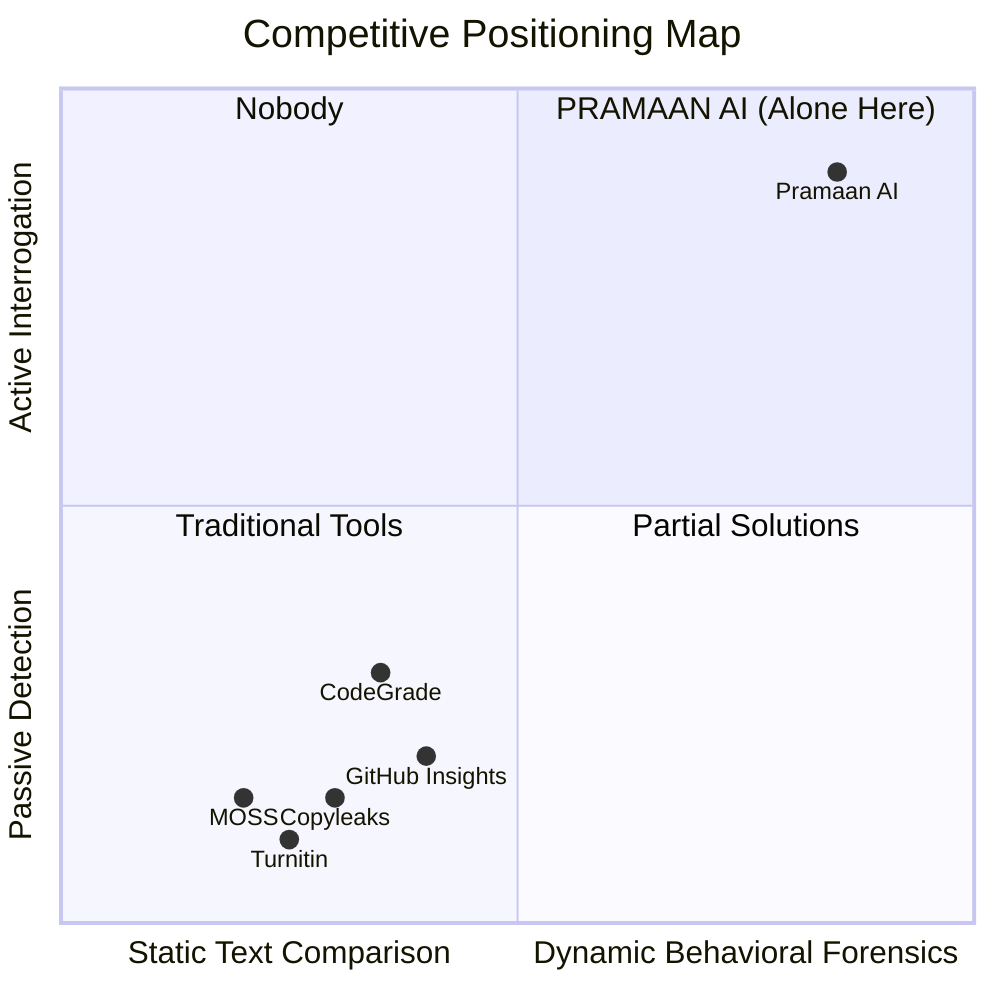

# ⚔️ Pramaan AI — Competitive Analysis & Unfair Advantage

> **Purpose:** Judges WILL ask: *"How is this different from MOSS, Turnitin, or just looking at GitHub Insights?"* This document arms you with an airtight, data-backed answer that proves Pramaan AI is in a completely different league.

---

## 1. The Competitive Landscape

### Existing Tools & Their Fatal Limitations

---

### Tool-by-Tool Teardown

#### 1. MOSS (Measure of Software Similarity) — Stanford
| Aspect | MOSS | Pramaan AI |
| :--- | :--- | :--- |
| **What it does** | Compares code files between student submissions for textual similarity | Analyzes behavioral git patterns, code complexity, and conducts live viva interrogation |
| **Detection method** | Static text fingerprinting (winnowing algorithm) | Dynamic: temporal commit forensics + AST semantic weighting + AI-powered oral defense |
| **Catches copy between students?** | ✅ Yes (its primary purpose) | ✅ Yes (via structural similarity detection) |
| **Catches copy from internet?** | ❌ No (only compares submitted set) | ✅ Yes (behavioral flags: Big Bang dumps with 0 churn) |
| **Catches AI-generated code?** | ❌ No (AI output is unique each time) | ✅ Yes (Viva defense exposes inability to explain code decisions) |
| **Identifies freeloaders in teams?** | ❌ No (doesn't analyze git history) | ✅ Yes (contributor-level forensic attribution) |
| **Verifies understanding?** | ❌ No | ✅ Yes (autonomous line-targeted viva) |
| **Real-time?** | ❌ Batch processing, days to receive results | ✅ Under 15 seconds |

**MOSS's Fatal Flaw:** In 2026, students don't copy from each other anymore — they copy from ChatGPT. Every AI-generated output is textually unique, making MOSS completely blind to the #1 academic integrity threat.

---

#### 2. Turnitin (Text-Based Plagiarism)
| Aspect | Turnitin | Pramaan AI |
| :--- | :--- | :--- |
| **Domain** | Written essays and documents | Source code repositories |
| **Detection** | Compares text against internet + database of papers | Behavioral forensics on git commit patterns |
| **Code support?** | ❌ Terrible at code (treats it as plain text) | ✅ Purpose-built for code with AST parsing |
| **Team attribution?** | ❌ No | ✅ Per-contributor breakdown |
| **Comprehension check?** | ❌ No | ✅ AI viva defense |

**Turnitin's Fatal Flaw:** It's a document plagiarism tool pretending to handle code. It cannot parse syntax trees, understand function complexity, or trace git authorship.

---

#### 3. GitHub Insights / Contributors Tab
| Aspect | GitHub Insights | Pramaan AI |
| :--- | :--- | :--- |
| **Shows commit counts?** | ✅ Yes | ✅ Yes |
| **Shows lines added/deleted?** | ✅ Yes | ✅ Yes |
| **Differentiates boilerplate vs core logic?** | ❌ No (all lines equal) | ✅ Yes (4-tier AST weighting) |
| **Detects copy-paste dumps?** | ❌ No | ✅ Yes (anomaly heuristics) |
| **Questions the author?** | ❌ No | ✅ Yes (autonomous viva) |
| **Generates proof-of-work receipt?** | ❌ No | ✅ Yes (cryptographic receipt) |

**GitHub Insights' Fatal Flaw:** A student who copy-pastes 5,000 lines from a tutorial shows the SAME green contribution graph as someone who wrote 5,000 lines of custom algorithms. GitHub counts lines, not intelligence.

---

#### 4. CodeGrade / Gradescope (Auto-Grading Platforms)
| Aspect | CodeGrade | Pramaan AI |
| :--- | :--- | :--- |
| **Auto-grades assignments?** | ✅ Yes (test-case based) | ❌ Not our scope |
| **Analyzes team dynamics?** | ❌ No | ✅ Yes (forensic contributor profiling) |
| **Detects freeloaders?** | ❌ No | ✅ Yes |
| **AI-powered viva?** | ❌ No | ✅ Yes |
| **Works on existing repos?** | ❌ No (needs platform-specific submission) | ✅ Yes (any public GitHub URL) |

---

## 2. Pramaan AI's Three Unfair Advantages (The Moat)

### Moat #1: Temporal Behavioral Forensics (Nobody Else Does This)
Every existing tool analyzes the FINAL STATE of code. Pramaan AI analyzes the JOURNEY:
- **When** was the code written? (3 AM panic dump vs steady afternoon sessions)
- **How** was it written? (atomic commits vs monolithic inject)
- **Did it evolve?** (write → test → debug → refactor vs single paste with 0 deletions)

This is like the difference between checking if a painting is oil-on-canvas (static analysis) vs watching the security camera footage of the artist painting it (behavioral forensics).

### Moat #2: AST Semantic Weighting (Lines ≠ Value)
No tool in the market differentiates between:
- 500 lines of `package-lock.json` (Tier 0, zero value)
- 500 lines of React boilerplate JSX (Tier 1, low value)
- 500 lines of custom authentication with distributed locking (Tier 3, high value)

Pramaan AI's AST parser assigns mathematical weight to code complexity, ensuring a student who wrote 200 lines of a custom algorithm scores higher than one who dumped 5,000 lines of template CSS.

### Moat #3: Autonomous Viva Defense (The Kill Shot)
This is our **nuclear differentiator.** No other tool in existence does this:
- Generates questions that are **mathematically impossible to answer without having written the code**
- Questions reference exact line numbers, commit hashes, and function signatures
- Evaluates answers against the code's actual AST reality, not generic textbook knowledge
- Catches AI-fluffy answers ("This function efficiently handles...") vs builder answers ("I had to add a mutex here because concurrent refreshes were invalidating tokens")

---

## 3. The "Why Not Just..." Objection Handler

| Judge Says | Your Response |
| :--- | :--- |
| *"Why not just look at git blame?"* | "Git blame shows WHO committed a line, not whether they UNDERSTAND it. A student can `git commit --author='teammate'` or dump code without comprehension. Pramaan AI's viva defense verifies the human behind the commit." |
| *"Why not just do a manual viva?"* | "A professor has 3 minutes per team and 20 teams. They ask generic questions ('Explain your architecture') that any coached student can rehearse. Pramaan AI generates line-specific, un-rehearsable questions from the actual code diff." |
| *"Can't students just game the commits?"* | "If a student makes 40 small fake commits (adding one line at a time), the AST classifier catches it — those lines will be Tier 0/1 boilerplate. And the Viva Hot Seat will expose that they can't explain any Tier 3 logic." |
| *"What about pair programming?"* | "Pair programming shows shared commits on the same file, not a ghost who never touches code. Both pair partners should pass the viva on shared code — if only one can explain it, that reveals the real author." |

---

## 4. One-Sentence Positioning

> **"MOSS catches students who copy from each other. Turnitin catches students who copy from the internet. Pramaan AI catches students who copy from ChatGPT — and proves who actually UNDERSTANDS the code."**

Use this line in your pitch. It's the sharpest competitive positioning statement.
