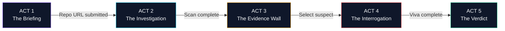

# 🎬 Pramaan AI — Cinematic Forensic Design System v2.0

> **Design Philosophy:** This is NOT a dashboard. This is a **cinematic code investigation experience** — a detective movie where the judge is the detective, the repository is the crime scene, and Pramaan AI is the forensic lab that reveals the truth. Every screen transition tells a story. Every animation has narrative purpose. Every pixel earns its place.

---

## 1. The Narrative Arc (Judge's Journey)

Judges don't want to "use a tool." They want to **experience a revelation.** Pramaan AI is structured as a **5-Act cinematic story:**

```
ACT 1: THE BRIEFING        → Cinematic landing + repo URL input
ACT 2: THE INVESTIGATION    → Live forensic scanning with real-time data streaming
ACT 3: THE EVIDENCE WALL    → Interactive crime board exposing contributor patterns
ACT 4: THE INTERROGATION    → AI Viva "Hot Seat" with split-screen terminal
ACT 5: THE VERDICT          → Dramatic score reveal + Verifiable Proof Receipt
```



---

## 2. Visual Identity & Design Tokens

### 2.1 Color System — "Obsidian Forensics"

The color palette is built around a **forensic crime lab** metaphor. Deep blacks establish authority. Neon accents are reserved for evidence, warnings, and verdicts — they must feel like critical information under UV light.

```css
:root {
  /* ══════════════ BACKGROUNDS ══════════════ */
  --bg-void:            #050507;    /* Deepest void — page canvas behind everything */
  --bg-obsidian:        #0A0D14;    /* Primary app background */
  --bg-card:            #0F1629;    /* Card surfaces, panels */
  --bg-card-hover:      #151D35;    /* Card hover / active state */
  --bg-elevated:        #1A2342;    /* Modals, popovers, floating panels */
  --bg-code:            #0D1117;    /* Code blocks (GitHub dark) */
  --bg-input:           #0C1220;    /* Input fields, text areas */

  /* ══════════════ BORDERS & DIVIDERS ══════════════ */
  --border-subtle:      #1E293B;    /* Hairline card borders */
  --border-active:      #334155;    /* Focused / active element borders */
  --border-glow-emerald: rgba(16, 185, 129, 0.4);
  --border-glow-crimson: rgba(239, 68, 68, 0.4);
  --border-glow-cyan:    rgba(6, 182, 212, 0.4);

  /* ══════════════ FORENSIC STATUS NEONS ══════════════ */
  --neon-emerald:       #10B981;    /* VERIFIED / PROOF / SAFE */
  --neon-emerald-soft:  #059669;    /* Secondary emerald */
  --neon-emerald-glow:  0 0 20px rgba(16, 185, 129, 0.35), 0 0 60px rgba(16, 185, 129, 0.1);

  --neon-amber:         #F59E0B;    /* WARNING / SUSPICIOUS / UNUSUAL */
  --neon-amber-soft:    #D97706;
  --neon-amber-glow:    0 0 20px rgba(245, 158, 11, 0.35), 0 0 60px rgba(245, 158, 11, 0.1);

  --neon-crimson:       #EF4444;    /* FRAUD / FREELOADER / ALERT */
  --neon-crimson-soft:  #DC2626;
  --neon-crimson-glow:  0 0 20px rgba(239, 68, 68, 0.35), 0 0 60px rgba(239, 68, 68, 0.1);

  --neon-cyan:          #06B6D4;    /* AI VIVA / SCANNING / ACTIVE PROCESS */
  --neon-cyan-soft:     #0891B2;
  --neon-cyan-glow:     0 0 20px rgba(6, 182, 212, 0.35), 0 0 60px rgba(6, 182, 212, 0.1);

  --neon-purple:        #8B5CF6;    /* AST COMPLEXITY / DEEP LOGIC */
  --neon-purple-soft:   #7C3AED;
  --neon-purple-glow:   0 0 20px rgba(139, 92, 246, 0.35), 0 0 60px rgba(139, 92, 246, 0.1);

  /* ══════════════ TEXT HIERARCHY ══════════════ */
  --text-primary:       #F1F5F9;    /* Headlines, primary content */
  --text-secondary:     #94A3B8;    /* Descriptions, secondary labels */
  --text-muted:         #64748B;    /* Timestamps, metadata, captions */
  --text-ghost:         #475569;    /* Placeholder text, disabled states */

  /* ══════════════ GRADIENTS ══════════════ */
  --gradient-hero:      linear-gradient(135deg, #0F172A 0%, #1E1B4B 50%, #0F172A 100%);
  --gradient-card-shine: linear-gradient(135deg, rgba(255,255,255,0.03) 0%, transparent 50%);
  --gradient-scan-line:  linear-gradient(180deg, transparent 0%, rgba(6, 182, 212, 0.08) 50%, transparent 100%);
}
```

### 2.2 Typography System

```css
/* DISPLAY — Used for ACT titles, hero headlines, dramatic reveals */
--font-display: 'Space Grotesk', 'Syne', system-ui, sans-serif;
/* Weights: 700 (Bold headlines), 500 (Sub-headlines) */
/* Sizes: 48px (Hero), 36px (Act Title), 28px (Section Head) */

/* BODY — Used for descriptions, labels, paragraphs */
--font-body: 'Inter', 'General Sans', system-ui, sans-serif;
/* Weights: 600 (Bold labels), 400 (Body text), 300 (Light captions) */
/* Sizes: 16px (Body), 14px (Small), 12px (Caption) */

/* CODE — Used for commit hashes, file paths, code snippets, metrics */
--font-mono: 'JetBrains Mono', 'Fira Code', 'Cascadia Code', monospace;
/* Feature: font-variant-ligatures: contextual (enables => === != ligatures) */
/* Sizes: 14px (Code blocks), 13px (Inline code), 11px (Receipt mono) */
```

### 2.3 Spacing & Layout Grid

```css
/* 8px base grid system */
--space-1: 4px;    --space-2: 8px;    --space-3: 12px;
--space-4: 16px;   --space-5: 20px;   --space-6: 24px;
--space-8: 32px;   --space-10: 40px;  --space-12: 48px;
--space-16: 64px;  --space-20: 80px;  --space-24: 96px;

/* Border Radius */
--radius-sm: 6px;   --radius-md: 10px;  --radius-lg: 16px;
--radius-xl: 24px;  --radius-full: 9999px;

/* Card Shadows (Layered depth) */
--shadow-card: 0 1px 3px rgba(0,0,0,0.4), 0 8px 24px rgba(0,0,0,0.3);
--shadow-elevated: 0 4px 12px rgba(0,0,0,0.5), 0 16px 48px rgba(0,0,0,0.4);
--shadow-neon-emerald: 0 0 1px var(--neon-emerald), var(--neon-emerald-glow);
--shadow-neon-crimson: 0 0 1px var(--neon-crimson), var(--neon-crimson-glow);
```

---

## 3. Background & Atmosphere Layer

### 3.1 Animated Dot Grid Canvas (Behind Everything)

A full-viewport CSS/Canvas dot grid that subtly breathes — establishing the "forensic lab" atmosphere without distracting from content.

```css
.forensic-grid-bg {
  position: fixed;
  inset: 0;
  z-index: 0;
  background-image:
    radial-gradient(circle at 1px 1px, rgba(148, 163, 184, 0.08) 1px, transparent 0);
  background-size: 32px 32px;
  /* Subtle floating animation — grid slowly drifts upward */
  animation: grid-drift 120s linear infinite;
}

@keyframes grid-drift {
  0% { background-position: 0 0; }
  100% { background-position: 0 -1000px; }
}
```

### 3.2 Floating Code Particles (Canvas/Three.js — Optional for WOW Factor)

Faint, semi-transparent code keywords (`async`, `function`, `return`, `commit`, `merge`, `proof`) drift slowly across the background like floating evidence in a dark room. They are tiny (10-12px), ghostly (`opacity: 0.04-0.08`), and move at 0.2px/frame.

**Implementation:** Use a lightweight `<canvas>` element with ~30 floating text particles. No heavy 3D library needed.

### 3.3 Scan Line Sweep (During ACT 2 — Investigation Phase)

A horizontal cyan-tinted gradient line sweeps vertically down the screen every 4 seconds during the scanning phase, evoking the feeling of a lab scanner analyzing evidence:

```css
.scan-sweep::after {
  content: '';
  position: fixed;
  left: 0; right: 0;
  height: 2px;
  background: linear-gradient(90deg, transparent, var(--neon-cyan), transparent);
  box-shadow: var(--neon-cyan-glow);
  animation: sweep-down 4s ease-in-out infinite;
}

@keyframes sweep-down {
  0% { top: -2px; opacity: 0; }
  10% { opacity: 1; }
  90% { opacity: 1; }
  100% { top: 100vh; opacity: 0; }
}
```

---

## 4. ACT-by-ACT Screen Design

---

### 🎬 ACT 1: THE BRIEFING (Landing & Input)

**Narrative Purpose:** The judge enters a dark, atmospheric forensic command center. A single glowing terminal input waits for the suspect repository URL. The moment feels like "initiating an investigation."

#### Layout Blueprint:
```
┌─────────────────────────────────────────────────────────────────┐
│                     [Dot Grid Background]                       │
│                                                                 │
│              ⚖️  (Pramaan Logo — Glitch-in Animation)           │
│                                                                 │
│              P R A M A A N   A I                                │
│              प्रमाण — Proof of Work                               │
│                                                                 │
│     "Har Code Ka Pramaan" ← (Typewriter character-by-char)      │
│                                                                 │
│  ┌─────────────────────────────────────────────────────────┐    │
│  │  🔗  Paste GitHub Repository URL...                     │    │
│  │  ─────────────────────────────────────────────────────  │    │
│  │  https://github.com/team/capstone-project   [⏎ ENTER]  │    │
│  └─────────────────────────────────────────────────────────┘    │
│                                                                 │
│       Branch: [main ▾]    Depth: [Full History ▾]               │
│                                                                 │
│               [ ▶ INITIATE INVESTIGATION ]                      │
│                  ↑ Glowing cyan pulsing border                  │
│                                                                 │
│  ── "Trusted by 0 projects. Be the first." ──                  │
│                                                                 │
└─────────────────────────────────────────────────────────────────┘
```

#### Key Interactions & Animations:

1. **Logo Entry Animation (0-2 seconds):**
   - Screen starts pure black (`#050507`).
   - The `⚖️` Pramaan icon scales from 0 → 1 with a subtle glitch/distortion effect (CSS `clip-path` animation with random horizontal slices for 0.3s, then settles).
   - Text `P R A M A A N  A I` fades in letter-by-letter with 40ms stagger delay. Each letter has a faint cyan text-shadow on entry that fades after 200ms.

2. **Tagline Typewriter (2-3.5 seconds):**
   - `"Har Code Ka Pramaan"` types out character-by-character with a blinking block cursor (`█`).
   - Cursor blinks at `530ms` interval after typing completes.

3. **Input Field — "The Investigation Terminal":**
   - Dark input field (`--bg-input`) with `1px` border (`--border-subtle`).
   - On focus: border transitions to `--neon-cyan` with `box-shadow: var(--neon-cyan-glow)`. The dot grid background behind the input subtly brightens.
   - As the user types a URL, each character produces a very soft keystroke CSS animation (tiny `scale(1.02)` bounce on the input container).

4. **CTA Button — "INITIATE INVESTIGATION":**
   - Default: `--bg-card` background, `--neon-cyan` text, `1px` cyan border.
   - Hover: Background fills with `--neon-cyan`, text inverts to `--bg-obsidian`. A `2px` expanding glow ring animates outward (like a sonar ping).
   - Click: Button text changes to `"SCANNING..."` with a rotating spinner icon. The entire page begins a zoom-in transition into ACT 2.

5. **Page Transition to ACT 2:**
   - The input card zooms forward (scale 1 → 1.15, opacity 1 → 0) while the background darkens.
   - Simultaneously, the ACT 2 scanning interface fades up from below.
   - Total transition: `600ms` with `cubic-bezier(0.16, 1, 0.3, 1)` (smooth deceleration).

---

### 🔬 ACT 2: THE INVESTIGATION (Live Forensic Scanning)

**Narrative Purpose:** The judge watches Pramaan AI dissect the repository in real-time. Metrics stream in. Progress bars fill. The excitement builds as anomalies are flagged live.

#### Layout Blueprint:
```
┌─────────────────────────────────────────────────────────────────┐
│  PRAMAAN AI  │  Investigating: github.com/team/capstone  │ ⏱ 12s│
├─────────────────────────────────────────────────────────────────┤
│                                                                 │
│  ┌─── PHASE PROGRESS ─────────────────────────────────────────┐ │
│  │ [████████████████████░░░░] 78%  Phase: AST Parsing          │ │
│  │                                                             │ │
│  │  ✅ Cloning Repository .............. 2.1s                  │ │
│  │  ✅ Mining 142 Commits .............. 4.8s                  │ │
│  │  ✅ Identity Resolution (3→2 authors) 0.4s                 │ │
│  │  ⏳ AST Tier Classification ......... [ACTIVE]              │ │
│  │  ○  Anomaly Detection .............. [PENDING]              │ │
│  │  ○  Viva Question Generation ....... [PENDING]              │ │
│  └─────────────────────────────────────────────────────────────┘ │
│                                                                 │
│  ┌─── LIVE METRICS STREAM ────────────────────────────────────┐ │
│  │                                                             │ │
│  │  Total Commits    Lines Audited    Contributors    Files    │ │
│  │     142              28,491            2            67     │ │
│  │  (counting up)    (counting up)    (resolved)   (filtered) │ │
│  │                                                             │ │
│  │  ┌── EARLY RED FLAGS (Live Detection) ────────────────┐    │ │
│  │  │  🚩 FLAG_BIG_BANG — Author "Aryan_K"               │    │ │
│  │  │     1 commit | +4,821 lines | 0 deletions           │    │ │
│  │  │     Timestamp: Oct 14, 03:42 AM (6h before deadline)│    │ │
│  │  └────────────────────────────────────────────────────┘    │ │
│  └─────────────────────────────────────────────────────────────┘ │
│                                                                 │
│  ── Terminal Log (scrolling monospace output) ──                │
│  > Traversing commit graph... 142 commits found                 │
│  > Resolving identities: alex@uni.edu ↔ alex.dev@gmail.com     │
│  > Classifying: src/engine/recommender.py → TIER 3 (3.0x)      │
│  > ⚠ Anomaly: Author Aryan_K — zero-churn monolithic inject    │
│                                                                 │
└─────────────────────────────────────────────────────────────────┘
```

#### Key Interactions & Animations:

1. **Counting Numbers:**
   - All metric numbers (commits, lines, files) animate from 0 to final value using a smooth `countUp` animation over 1.5s with easing. Numbers tick rapidly at the start, then decelerate.
   - Font: `JetBrains Mono`, size `32px`, color `--text-primary`, with subtle `text-shadow: 0 0 8px rgba(6,182,212,0.3)`.

2. **Phase Progress Bar:**
   - Thin (`6px` height), rounded, with animated gradient fill (`--neon-cyan` → `--neon-purple`).
   - The active phase text pulses with a breathing opacity animation (`opacity: 0.7 → 1 → 0.7` over `2s`).
   - Completed phases get a `✅` checkmark with a satisfying pop-in scale animation.

3. **Red Flag Alert Card:**
   - When a red flag is detected mid-scan, a card SLAMS in from the right side with a dramatic spring animation (`translateX(100%) → translateX(0)`, `stiffness: 400, damping: 20`).
   - Left border: `3px solid var(--neon-crimson)`.
   - Background: `rgba(239, 68, 68, 0.06)`.
   - On entry: A brief screen-wide red flash (`opacity: 0 → 0.04 → 0`, `200ms`) to simulate an "alarm trigger."

4. **Terminal Log (Bottom Section):**
   - Monospace scrolling log (`JetBrains Mono, 13px, --text-muted`).
   - New lines slide in from the bottom with a `translateY(8px) → 0` fade-in.
   - Anomaly lines are highlighted in `--neon-amber` text.
   - Auto-scrolls to latest. Judge can scroll up to review.

5. **Completion Transition to ACT 3:**
   - Progress bar fills to 100%. All numbers finalize.
   - A `1.5s` pause. Then the text `"INVESTIGATION COMPLETE"` types out in the center in `Space Grotesk 28px --neon-emerald`.
   - The scanning UI fades away and the Evidence Wall (ACT 3) builds itself piece-by-piece from the center outward.

---

### 🕵️ ACT 3: THE EVIDENCE WALL (Contributor Forensics Dashboard)

**Narrative Purpose:** This is the detective's cork board. All evidence is laid out. The judge can explore, compare, filter, and identify who the real builders are vs. the freeloaders.

#### Layout Blueprint:
```
┌─────────────────────────────────────────────────────────────────────────┐
│  PRAMAAN AI  │  Evidence Wall — capstone-project  │ 2 Contributors      │
├─────────────────────────────────────────────────────────────────────────┤
│                                                                         │
│  ┌──── NAVIGATION TABS ─────────────────────────────────────────────┐   │
│  │  [ 📊 Overview ]  [ 🕐 Crime Timeline ]  [ 🧬 DNA Radar ]       │   │
│  │  [ 📁 File Heatmap ]  [ 🚩 Red Flags ]                          │   │
│  └──────────────────────────────────────────────────────────────────┘   │
│                                                                         │
│  ════════════════════════════════════════════════════════════════════    │
│                                                                         │
│  ┌─── CONTRIBUTOR CARDS (Side by Side) ────────────────────────────┐   │
│  │                                                                  │   │
│  │  ┌──────────────────────┐    ┌──────────────────────┐           │   │
│  │  │  👤 ROHIT SHARMA     │    │  👤 ARYAN KUMAR       │           │   │
│  │  │  ───────────────     │    │  ───────────────      │           │   │
│  │  │  Commits: 41         │    │  Commits: 3           │           │   │
│  │  │  Core Lines: 12,840  │    │  Core Lines: 4,821    │           │   │
│  │  │  Churn: 38% ██████░  │    │  Churn: 0% ░░░░░░░   │           │   │
│  │  │  Tier 3: 72% ██████  │    │  Tier 3: 8% █░░░░░   │           │   │
│  │  │  ───────────────     │    │  ───────────────      │           │   │
│  │  │  🟢 VERIFIED BUILDER │    │  🔴 SUSPECT           │           │   │
│  │  │  Pramaan: 94/100     │    │  Pramaan: --/100      │           │   │
│  │  │                      │    │                       │           │   │
│  │  │  [🎙 START VIVA]     │    │  [🎙 START VIVA]      │           │   │
│  │  └──────────────────────┘    └──────────────────────┘           │   │
│  └──────────────────────────────────────────────────────────────────┘   │
│                                                                         │
└─────────────────────────────────────────────────────────────────────────┘
```

#### Sub-Tabs & Their Interactive Content:

##### Tab 1: 📊 Overview — Contributor Comparison Cards
- **Side-by-side contributor cards** with all key metrics.
- Each card has a **colored left border:** `--neon-emerald` for clean contributors, `--neon-crimson` for flagged contributors, `--neon-amber` for suspicious.
- **Metric bars** are horizontal progress bars that animate on load (width transitions from 0% → final over 800ms with stagger between metrics).
- **Hover Effect:** Card lifts slightly (`translateY(-2px)`) with increased `box-shadow`.
- **"START VIVA" Button:** Glows with the contributor's status color. Clicking transitions to ACT 4.

##### Tab 2: 🕐 Crime Timeline — The Interactive Scrubber
The signature forensic widget. A horizontal timeline visualizing every commit:

```
Day 1        Day 4        Day 7        Day 10       Day 14
  │            │            │            │            │
  ●──●──●──●───●──●─────────●───●──●─────●────────────●(💥 DUMP)
  ↑ Rohit      ↑ Rohit       ↑ Rohit                   ↑ Aryan
  +45 lines    +120 lines    +380 lines                 +4,821 lines
  "init auth"  "fix token"   "add caching"              "fixes"
```

- **Commit Nodes:** Small circles (`12px` diameter).
  - Rohit's commits: `--neon-emerald` (verified builder pattern).
  - Aryan's commit: `--neon-crimson` with pulsing glow ring animation.
- **Hover on Node:** A tooltip card appears below showing:
  - Author, hash, timestamp, commit message, lines added/deleted, files changed.
  - Code snippet preview of the most significant change.
- **The "Big Bang" Node (💥):**
  - Larger circle (`20px`), pulsating crimson glow.
  - On hover, an expanded "Explosion Card" drops down with full forensic breakdown:
    - `🚩 Big Bang Dump Detected`
    - `+4,821 lines | -0 lines | 1 commit | 03:42 AM`
    - `98% structural match with public tutorial repo`
- **Playback Mode:** Click `▶ Play` to auto-advance through timeline. Each commit pops in sequence with a soft tick sound. Speed controls: `1x`, `2x`, `5x`.
- **Drag Scrubber Handle:** A draggable handle on the timeline bar lets the judge scrub to any point.

##### Tab 3: 🧬 DNA Radar — Contributor Proof-of-Work Fingerprint
A **5-axis polar/radar chart** built with Recharts or custom SVG:

**Axes:**
1. **Algorithmic Depth** (Tier 3 code ratio)
2. **Iterative Churn** (modify + delete ratio indicating real debugging)
3. **Commit Consistency** (steady cadence vs panic bursts)
4. **Code Breadth** (number of distinct modules/files meaningfully touched)
5. **AST Complexity** (average cyclomatic complexity of authored functions)

**Interactivity:**
- Each contributor is a colored polygon overlaid on the same chart.
- Click a contributor's name to **isolate** their polygon (others fade to 10% opacity).
- Click "Compare All" to overlay all polygons with distinct colors.
- Hover on any axis vertex to see the **exact commits and code** that earned that score.
- Smooth morphing animation when toggling between contributors (polygon vertices animate to new positions over `400ms`).

##### Tab 4: 📁 File Heatmap — Who Owns What
A **treemap visualization** where each rectangle represents a file/directory in the repo. Size = lines of code, color = primary author.

- Hover on any file rectangle: Shows author, tier classification, line count, last modified commit.
- Click: Opens the `DiffInspector` modal showing the actual code with line-by-line `git blame` coloring.
- Color legend at top: Each contributor gets a distinct hue. Shared files show a gradient blend.

##### Tab 5: 🚩 Red Flags — Anomaly Dossier
A vertical list of all detected anomalies, styled as "case files":

```
┌─ CASE #001 ─────────────────────────────────────────────┐
│  🚩 FLAG_BIG_BANG — Severity: CRITICAL                  │
│  Suspect: Aryan Kumar                                    │
│  Evidence: 1 commit, +4,821 lines, 0 deletions          │
│  Timestamp: Oct 14, 2026 at 03:42 AM                    │
│  Analysis: 98% structural similarity with public         │
│  tutorial "Building a Recommender System in Python"      │
│  Verdict: PROBABLE COPY-PASTE                            │
│  [📂 VIEW EVIDENCE] [🎙 INTERROGATE]                    │
└─────────────────────────────────────────────────────────┘
```

- Each case file card has a `--neon-crimson` left border for critical, `--neon-amber` for warnings.
- **"VIEW EVIDENCE"** opens the code diff modal.
- **"INTERROGATE"** jumps directly to ACT 4 with that contributor pre-selected.

---

### 🎙️ ACT 4: THE INTERROGATION (Autonomous Viva Defense)

**Narrative Purpose:** The climax. The contributor is "put on the hot seat." Pramaan AI's Gemini engine asks precise, un-fakeable questions about the code they claim to have authored. The judge watches the contributor either prove their expertise or crumble.

#### Layout Blueprint:
```
┌─────────────────────────────────────────────────────────────────────────┐
│  🎙 THE HOT SEAT  │  Examining: Aryan Kumar  │  Question 1 of 3        │
├─────────────────────────────────────────────────────────────────────────┤
│                                                                         │
│  ┌──── THE EVIDENCE (Left Panel) ──────┐ ┌── THE EXAMINER (Right) ──┐  │
│  │                                      │ │                          │  │
│  │  📄 src/engine/recommender.py        │ │  PRAMAAN AI EXAMINER     │  │
│  │  Commit: #4a82e1 by Aryan Kumar      │ │  ─────────────────────   │  │
│  │  ────────────────────────────        │ │                          │  │
│  │  71 │ class Recommender:             │ │  "Aryan, in commit       │  │
│  │  72 │   def __init__(self, k=10):    │ │  #4a82e1, you defined    │  │
│  │  73 │     self.k = k                 │ │  a `collaborative_filter`│  │
│  │  74 │     self.model = None          │ │  function at line 78.    │  │
│  │  75 │                                │ │                          │  │
│  │  76 │   def train(self, data):       │ │  If your similarity      │  │
│  │  77 │     self.model = SVD()         │ │  matrix has 50,000 users │  │
│  │ >78 │   def collaborative_filter(    │ │  and the cosine sim      │  │
│  │ >79 │     self, user_id, topn=5):    │ │  computation takes O(n²),│  │
│  │ >80 │     sims = cosine_similarity(  │ │  what optimization did   │  │
│  │ >81 │       self.matrix[user_id],    │ │  you apply — or did you  │  │
│  │ >82 │       self.matrix)             │ │  not consider scale?"    │  │
│  │  83 │     return argsort(sims)[:topn]│ │                          │  │
│  │                                      │ │  Difficulty: ██████ HARD │  │
│  │  Lines 78-82 highlighted with        │ │  Category: SCALABILITY   │  │
│  │  glowing cyan left border            │ │                          │  │
│  └──────────────────────────────────────┘ └──────────────────────────┘  │
│                                                                         │
│  ┌──── RESPONSE ZONE ──────────────────────────────────────────────┐   │
│  │                                                                  │   │
│  │    [🎙 SPEAK YOUR ANSWER]        [⌨️ TYPE YOUR EXPLANATION]     │   │
│  │                                                                  │   │
│  │    ┌─ Audio Waveform ─────────────────────────────────────┐     │   │
│  │    │  ~~~|/\/\/\|~~~|/\|~~~|/\/\/\/\/\|~~~                │     │   │
│  │    └──────────────────────────────────────────────────────┘     │   │
│  │                                                                  │   │
│  │    OR: Type here...                                              │   │
│  │    ┌──────────────────────────────────────────────────────┐     │   │
│  │    │                                                      │     │   │
│  │    └──────────────────────────────────────────────────────┘     │   │
│  │                                                 [SUBMIT ANSWER] │   │
│  └──────────────────────────────────────────────────────────────────┘   │
│                                                                         │
│  ┌──── AUTHENTICITY METER ─────────────────────────────────────────┐   │
│  │  ░░░░░░░░░░░░░░░░░░░░░░░░░░░░░░░░░░░░░░░░░░░ — AWAITING INPUT │   │
│  │  FREELOADER ◄──────────────────────────────────► VERIFIED       │   │
│  └──────────────────────────────────────────────────────────────────┘   │
│                                                                         │
└─────────────────────────────────────────────────────────────────────────┘
```

#### Key Interactions & Animations:

1. **Code Evidence Panel (Left):**
   - Syntax-highlighted code using Prism.js or Shiki (dark theme matching `--bg-code`).
   - The specific lines referenced in the AI question (lines 78-82) are highlighted:
     - Left gutter: Glowing cyan border (`3px solid --neon-cyan` with `box-shadow`).
     - Background: `rgba(6, 182, 212, 0.06)`.
   - Line numbers in `--text-muted`. Active lines in `--neon-cyan`.
   - The highlight PULSES gently (opacity `0.06 → 0.12 → 0.06` over `3s`) to draw the judge's eye.

2. **AI Examiner Panel (Right):**
   - The question text streams in **character-by-character** with a `30ms` delay per character (typewriter effect).
   - A blinking block cursor (`█`) follows the streaming text.
   - As specific line numbers are mentioned in the question (e.g., "line 78"), the corresponding lines in the left panel get highlighted in real-time with a flash animation.
   - After streaming completes, the difficulty badge and category slide in from the bottom.

3. **Audio Waveform Visualizer:**
   - Uses Web Audio API `AnalyserNode` to capture microphone frequency data.
   - Renders as a dynamic SVG path with smooth interpolation.
   - Color: `--neon-cyan` when listening, `--neon-emerald` when processing.
   - Subtle glow effect: `filter: drop-shadow(0 0 4px var(--neon-cyan))`.

4. **Authenticity Meter (Bottom):**
   - A wide horizontal bar, initially grey/empty.
   - After answer submission, the bar fills from left to right over `2s`:
     - `0-30%`: Fills with `--neon-crimson` gradient. Label: `PROBABLE FREELOADER`.
     - `31-65%`: Fills with `--neon-amber` gradient. Label: `INCONCLUSIVE`.
     - `66-85%`: Fills with `--neon-emerald-soft`. Label: `PROBABLE AUTHOR`.
     - `86-100%`: Fills with `--neon-emerald` + glow. Label: `✅ VERIFIED BUILDER`.
   - The fill animation uses `cubic-bezier(0.34, 1.56, 0.64, 1)` for a slight overshoot bounce effect.
   - Score number counts up simultaneously (e.g., `0 → 24` or `0 → 92`).

5. **Anti-Cheat Indicators:**
   - A small, subtle timer in the corner tracks "Time to First Keystroke" after question appears.
   - If answer is pasted (>200 chars in <1 second), a `⚠ PASTE DETECTED` amber badge appears.
   - These indicators are visible to the judge, adding credibility to the system.

---

### ⚖️ ACT 5: THE VERDICT (Score Reveal & Proof Receipt)

**Narrative Purpose:** The dramatic finale. All evidence is compiled. The composite Pramaan Score is revealed with cinematic tension. A verifiable, shareable proof receipt is generated.

#### Layout Blueprint:
```
┌─────────────────────────────────────────────────────────────────────────┐
│                                                                         │
│                        ⚖️ THE VERDICT                                   │
│                   capstone-project — Final Audit                        │
│                                                                         │
│  ┌──── SCORE REVEAL (Animated) ────────────────────────────────────┐   │
│  │                                                                  │   │
│  │     👤 ROHIT SHARMA              👤 ARYAN KUMAR                 │   │
│  │                                                                  │   │
│  │        ┌───────┐                    ┌───────┐                   │   │
│  │        │       │                    │       │                   │   │
│  │        │  94   │                    │  24   │                   │   │
│  │        │ /100  │                    │ /100  │                   │   │
│  │        └───────┘                    └───────┘                   │   │
│  │     ✅ VERIFIED BUILDER          🔴 SUSPECT FREELOADER          │   │
│  │                                                                  │   │
│  │  Git Forensics:  92/100            Git Forensics:  12/100       │   │
│  │  AST Complexity: 88/100            AST Complexity: 18/100       │   │
│  │  Viva Defense:   98/100            Viva Defense:   38/100       │   │
│  └──────────────────────────────────────────────────────────────────┘   │
│                                                                         │
│  ┌──── EXECUTIVE SUMMARY ──────────────────────────────────────────┐   │
│  │  "Rohit Sharma is the primary architect of this project,        │   │
│  │   authoring 92% of Tier-3 algorithmic logic across 41 atomic    │   │
│  │   commits over 14 days. Aryan Kumar's sole commit (4,821 lines  │   │
│  │   at 3:42 AM) shows 98% structural similarity to a public      │   │
│  │   tutorial with zero iterative debugging. Viva defense confirms │   │
│  │   Aryan could not explain the code's scalability trade-offs."   │   │
│  └──────────────────────────────────────────────────────────────────┘   │
│                                                                         │
│  ┌──── VERIFIABLE PROOF RECEIPT ───────────────────────────────────┐   │
│  │          (See Section 5 below for full receipt design)          │   │
│  └──────────────────────────────────────────────────────────────────┘   │
│                                                                         │
│  [ 📥 Download PDF Report ]  [ 🧾 Export Receipt ]  [ 🔗 Share Link ] │
│                                                                         │
└─────────────────────────────────────────────────────────────────────────┘
```

#### Key Interactions & Animations:

1. **The Dramatic Score Reveal:**
   - Screen dims. A brief `1s` pause of darkness with only the dot-grid visible.
   - The heading `⚖️ THE VERDICT` types in with `Space Grotesk 36px --text-primary`.
   - Score circles appear one at a time (left contributor first, then right with a `600ms` delay).
   - Each score is revealed via a **circular radial progress animation:**
     - An SVG circle (stroke-dasharray technique) draws itself from 0° to the final score percentage over `1.8s`.
     - Stroke color transitions: starts `--text-muted`, then shifts to the verdict color (`--neon-emerald` for high scores, `--neon-crimson` for low).
     - The number inside counts up from 0 to final value in sync with the circle.
   - For scores above 85: A burst of **confetti particles** (using `canvas-confetti` library) explodes from behind the score circle. Colors: emerald and gold.
   - For scores below 35: A subtle **red vignette flash** around the screen edges. The circle's stroke has a `--neon-crimson-glow` shadow.

2. **Sub-Score Breakdown:**
   - Below each main score, the three component scores (Git Forensics, AST Complexity, Viva Defense) slide in with staggered delays.
   - Each is a small horizontal bar with the score number. They fill left-to-right over `600ms`.

3. **Executive Summary:**
   - A bordered card (`1px --border-subtle`, `--bg-card` background).
   - Text streams in with typewriter effect (faster than ACT 4, `15ms` per character).
   - Key names are **bolded** and color-coded. Key numbers use `--font-mono`.

---

## 5. The Pramaan Proof Receipt — Digital Thermal Receipt Design

**Concept:** A digital artifact that looks and feels like a real thermal printer receipt — the kind you get from a convenience store, but for code proof-of-work. This is the shareable, embeddable artifact that Hoollow evaluators can verify.

```
┌────────────────────────────────────────┐ ← Jagged/torn top edge (SVG clip-path)
│                                        │
│  ░░░░░░░░░░░░░░░░░░░░░░░░░░░░░░░░░░  │ ← Subtle thermal noise texture
│                                        │
│         ⚖️ PRAMAAN AI                  │
│       PROOF-OF-WORK RECEIPT            │
│                                        │
│  ══════════════════════════════════    │
│  AUDIT ID: PRM-2026-8FAE491C          │
│  DATE:     Sep 15, 2026  10:42 IST    │
│  REPO:     team/capstone-project      │
│  BRANCH:   main                        │
│  COMMITS:  142 audited                 │
│  LINES:    28,491 analyzed             │
│  ══════════════════════════════════    │
│                                        │
│  CONTRIBUTOR BREAKDOWN                 │
│  ──────────────────────────────────    │
│  Rohit Sharma .... ✅ 94/100          │
│    Git:92  AST:88  Viva:98            │
│    Status: VERIFIED BUILDER            │
│                                        │
│  Aryan Kumar ..... 🔴 24/100          │
│    Git:12  AST:18  Viva:38            │
│    Status: SUSPECT FREELOADER          │
│  ──────────────────────────────────    │
│                                        │
│  INTEGRITY GRADE:  B+                  │
│  VERDICT: 1 of 2 contributors          │
│           verified as authentic.        │
│                                        │
│  ══════════════════════════════════    │
│                                        │
│       ┌──────────────┐                 │
│       │  ██ QR CODE ██│                │
│       │  ██████████████│                │
│       │  ██████████████│                │
│       └──────────────┘                 │
│   Scan to verify this audit            │
│                                        │
│  HASH: sha256:e4f81c9a...2b3d          │
│                                        │
│  ░░░░░░░░░░░░░░░░░░░░░░░░░░░░░░░░░░  │
│                                        │
│       Har Code Ka Pramaan.             │
│       pramaanai.vercel.app             │
│                                        │
└────────────────────────────────────────┘ ← Jagged/torn bottom edge
```

### Receipt Styling Details:

1. **Card Dimensions:** `max-width: 380px`, centered. Aspect ratio mimics a real receipt (narrow & tall).
2. **Background:** Off-white (`#FAF9F6`) in light version, dark slate (`#1A1F2E`) in dark version.
3. **Font:** Entirely `JetBrains Mono` at `12-13px`. Uppercase headings. Dot-leaders for name-score alignment (`.....`).
4. **Torn Edges:** Top and bottom edges use SVG `clip-path` with a randomized zigzag pattern:
   ```css
   .receipt {
     clip-path: polygon(
       0% 2%, 5% 0%, 10% 2%, 15% 1%, 20% 3%, 25% 0%, 30% 2%,
       35% 1%, 40% 3%, 45% 0%, 50% 2%, 55% 1%, 60% 3%, 65% 0%,
       70% 2%, 75% 1%, 80% 3%, 85% 0%, 90% 2%, 95% 1%, 100% 2%,
       100% 98%, 95% 100%, 90% 98%, 85% 99%, 80% 97%, 75% 100%,
       70% 98%, 65% 99%, 60% 97%, 55% 100%, 50% 98%, 45% 99%,
       40% 97%, 35% 100%, 30% 98%, 25% 99%, 20% 97%, 15% 100%,
       10% 98%, 5% 99%, 0% 98%
     );
   }
   ```
5. **Thermal Noise Overlay:** A CSS `background-image` with tiny noise to simulate thermal paper texture:
   ```css
   .receipt::before {
     content: '';
     position: absolute;
     inset: 0;
     background: url("data:image/svg+xml,..."); /* tiny noise SVG */
     opacity: 0.03;
     pointer-events: none;
   }
   ```
6. **QR Code:** Generated dynamically using `qrcode.react` library. Points to the hosted verification URL.
7. **Print Animation:** When generated, the receipt "prints" from top to bottom — content is revealed via a `clip-path` or `max-height` animation that grows from 0 to full height over `2s`, simulating paper coming out of a printer.

---

## 6. Component File Architecture

```
frontend/src/
├── app/
│   ├── page.tsx                          # ACT 1: Landing / Briefing
│   ├── investigate/[id]/page.tsx         # ACT 2: Live Scanning
│   ├── evidence/[id]/page.tsx            # ACT 3: Evidence Wall
│   ├── viva/[id]/[contributor]/page.tsx  # ACT 4: Hot Seat Viva
│   └── verdict/[id]/page.tsx            # ACT 5: Final Verdict & Receipt
│
├── components/
│   ├── layout/
│   │   ├── Navbar.tsx                    # Minimal top navigation bar
│   │   ├── ForensicGridBg.tsx            # Animated dot grid background
│   │   └── PageTransition.tsx            # Framer Motion page transition wrapper
│   │
│   ├── landing/
│   │   ├── GlitchLogo.tsx               # Logo with glitch entry animation
│   │   ├── TypewriterText.tsx            # Reusable typewriter text component
│   │   └── InvestigationInput.tsx        # The glowing repo URL input terminal
│   │
│   ├── scanning/
│   │   ├── PhaseProgress.tsx             # Step-by-step phase progress tracker
│   │   ├── LiveMetricCounters.tsx        # Animated counting numbers
│   │   ├── RedFlagAlertCard.tsx          # Slamming-in anomaly alert cards
│   │   └── TerminalLog.tsx              # Scrolling monospace log output
│   │
│   ├── evidence/
│   │   ├── ContributorCard.tsx           # Profile card with metrics & status badge
│   │   ├── CrimeTimeline.tsx             # Interactive commit timeline scrubber
│   │   ├── DnaRadarChart.tsx             # 5-axis polar proof-of-work chart
│   │   ├── FileHeatmap.tsx               # Treemap of file ownership by author
│   │   ├── RedFlagDossier.tsx            # Case-file styled anomaly list
│   │   └── DiffInspector.tsx             # Syntax-highlighted code diff modal
│   │
│   ├── viva/
│   │   ├── EvidencePanel.tsx             # Left: syntax highlighted code w/ glow lines
│   │   ├── ExaminerPanel.tsx             # Right: streaming AI question typewriter
│   │   ├── AudioWaveform.tsx             # Web Audio API microphone visualizer
│   │   ├── ResponseInput.tsx             # Text area + audio toggle for answers
│   │   ├── AuthenticityMeter.tsx         # Horizontal bar with animated fill & verdict
│   │   └── AntiCheatBadge.tsx            # Paste detection & TTFK timer
│   │
│   ├── verdict/
│   │   ├── ScoreRevealCircle.tsx         # Animated radial progress score ring
│   │   ├── SubScoreBreakdown.tsx         # Horizontal bars for Git/AST/Viva
│   │   ├── ExecutiveSummary.tsx          # Typewriter text card with AI-generated verdict
│   │   └── ConfettiBurst.tsx             # canvas-confetti wrapper for high scores
│   │
│   └── receipt/
│       ├── ThermalReceipt.tsx            # Complete styled receipt with torn edges
│       ├── QRCodeBlock.tsx               # Dynamic QR code generator
│       ├── PrintAnimation.tsx            # Top-to-bottom reveal animation
│       └── ExportActions.tsx             # Download PDF / Copy Badge / Share Link
│
├── hooks/
│   ├── useCountUp.ts                    # Smooth number counting animation hook
│   ├── useTypewriter.ts                 # Character-by-character text streaming hook
│   ├── useAudioAnalyser.ts              # Web Audio API frequency capture hook
│   └── useIntersectionReveal.ts         # Trigger animations when elements enter viewport
│
├── lib/
│   ├── api.ts                           # Axios/fetch wrappers for backend endpoints
│   ├── colors.ts                        # Design token constants exported as JS
│   └── animations.ts                    # Framer Motion variant presets & spring configs
│
└── styles/
    ├── globals.css                       # CSS variables, dot grid bg, base resets
    ├── receipt.css                       # Thermal receipt torn edges & noise texture
    └── fonts.css                         # @font-face for Space Grotesk, Inter, JetBrains Mono
```

---

## 7. Animation Presets & Motion Library

All animations use **Framer Motion** with consistent spring physics:

```typescript
// lib/animations.ts

// Standard card entry (used for ContributorCards, AlertCards)
export const cardEntry = {
  initial: { opacity: 0, y: 20, scale: 0.97 },
  animate: { opacity: 1, y: 0, scale: 1 },
  transition: { type: "spring", stiffness: 300, damping: 28 }
};

// Dramatic slam-in (used for RedFlag alerts)
export const slamFromRight = {
  initial: { opacity: 0, x: 200 },
  animate: { opacity: 1, x: 0 },
  transition: { type: "spring", stiffness: 400, damping: 22 }
};

// Stagger children (used for metric lists, score breakdowns)
export const staggerContainer = {
  animate: { transition: { staggerChildren: 0.08 } }
};

// Score reveal overshoot (used for AuthenticityMeter)
export const overshootFill = {
  transition: { type: "spring", stiffness: 120, damping: 14 }
};

// Page transition (used between ACTs)
export const pageSlide = {
  initial: { opacity: 0, y: 30 },
  animate: { opacity: 1, y: 0 },
  exit: { opacity: 0, y: -20, scale: 1.02 },
  transition: { duration: 0.5, ease: [0.16, 1, 0.3, 1] }
};
```

---

## 8. Responsive & Presentation Mode

### Presentation Mode (Judge Demo)
When presenting to judges on a projector or large screen:
- **Keyboard Shortcut `Ctrl+Shift+P`** toggles Presentation Mode.
- In Presentation Mode:
  - Font sizes increase by `20%`.
  - Card padding increases by `50%`.
  - All animations play at `0.8x` speed for dramatic effect.
  - A subtle spotlight/vignette darkens the edges of the screen to focus attention on center content.
  - The dot-grid background particles slow down.

### Mobile Responsive
- On screens `< 768px`: Two-column contributor cards stack vertically.
- The Crime Timeline becomes vertically scrollable instead of horizontal.
- The Viva Hot Seat uses a tabbed layout (Evidence tab ↔ Examiner tab) instead of side-by-side.
- The Thermal Receipt maintains its narrow width and scrolls within a centered container.
