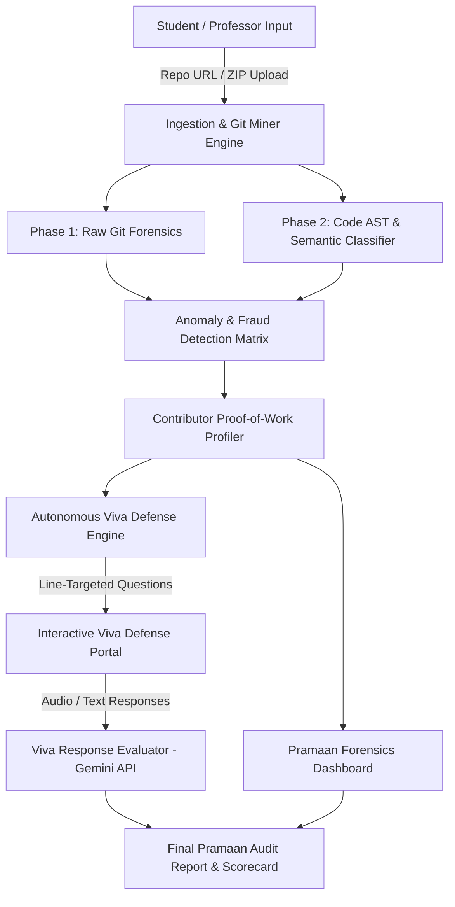
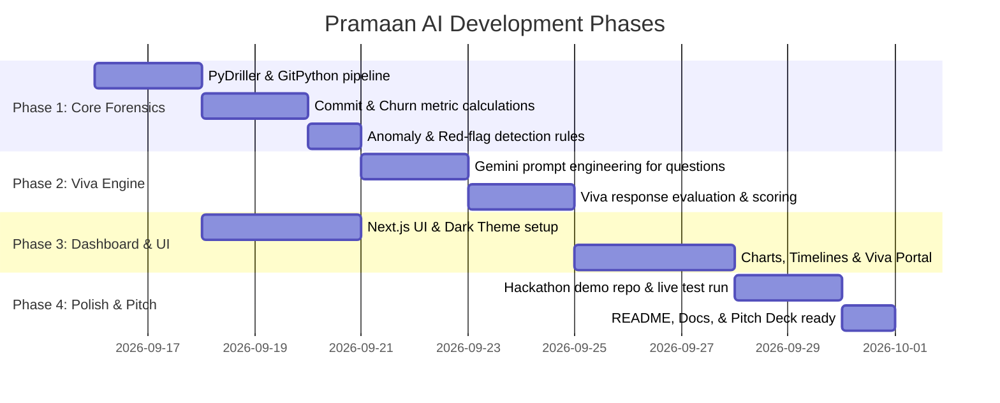

# 📜 Pramaan AI (प्रमाण AI) — Complete System Workflow & Architecture

> **Tagline:** *Har Code Ka Pramaan. Autonomous Code Forensics & Viva Defense Engine.*  
> **Mission:** Transform messy group repositories into verifiable proof of work by exposing copy-paste freeloaders and validating authentic builder craft through autonomous code forensics and hyper-targeted viva defense.

---

## 1. Executive Summary & Problem Scope

### The Problem
In academic institutions, capstone projects, and hackathons:
1. **The Freeloader Dilemma:** In a 4-person team, 1 or 2 students write 90% of the functional logic while others contribute boilerplate, CSS tweaks, or nothing at all, yet claim equal credit.
2. **AI-Dump & Tutorial Scrapers:** Students copy-paste entire repos or dump ChatGPT code in single massive commits without understanding fundamental data flows or edge cases.
3. **The Evaluator's Bottleneck:** Professors and judges have 3–5 minutes per team. They cannot manually inspect 200 commits, git blame histories, or AST diffs.
4. **Shallow Viva Evaluations:** Viva questions are generic (*"Explain your project architecture"*), which any prepared student can recite from memory even if they didn't write a single line.

### The Pramaan AI Solution
Pramaan AI acts as an **autonomous forensic auditor and AI viva defense examiner**:
- **Deep Git Forensics:** Analyzes commit velocity, churn, code blast radius, and commit burstiness to flag suspicious dumps.
- **True Ownership Attribution:** Separates boilerplate/configs from core algorithmic and business logic using AST / file classification.
- **Tailored Viva Defense Generator:** Generates deep, line-specific questions targeting code that each specific member claims to have committed.
- **Autonomous Grader & Verifiable Scorecard:** Assesses viva answers against the actual codebase AST and produces a shareable, tamper-proof **Pramaan Authenticity Scorecard (0–100)**.

---

## 2. High-Level System Architecture



---

## 3. Detailed End-to-End Pipeline

### Step 1: Repository Ingestion & Normalization
1. **Input Vectors:**
   - Public GitHub / GitLab repository URL.
   - Or direct `.zip` archive upload containing `.git` history.
2. **Repository Cloning & Sanitization:**
   - Cloned in an isolated sandbox with shallow/depth configuration (default full commit history).
   - Filter out vendor directories (`node_modules/`, `venv/`, `dist/`, `build/`, `.next/`, lockfiles `package-lock.json`, `pnpm-lock.yaml`, `poetry.lock`).
3. **Identity Resolution & Alias Mapping:**
   - Often one contributor commits using multiple emails or handles (e.g. `john@work.com`, `john@gmail.com`, `johnny_github`).
   - Run email/name fuzzy matching to cluster aliases under a single verified contributor profile.

---

### Step 2: Forensic Git Mining & Metrics Extraction
Using **PyDriller** and **GitPython**, the engine extracts commit-level and diff-level granular signals:

| Forensic Metric | Description | What It Tells Us |
| :--- | :--- | :--- |
| **Commit Cadence & Burstiness** | Frequency and timestamp clustering of commits across project timeline. | Did the contributor build steadily over weeks, or dump 10,000 lines 6 hours before deadline? |
| **Code Churn (Added vs Deleted)** | Ratio of lines added, modified, and deleted per author. | High churn indicates iterative debugging and real coding; massive additions with zero deletion often indicates copy-paste. |
| **Blast Radius & Diff Granularity** | Average files and lines modified per commit. | Atomic commits (1-5 files, <150 lines) reflect structured development vs "Big Bang" single dumps (50+ files). |
| **Active Coding Time Window** | Timestamp distribution (hour-of-day, day-of-week). | Identifies abnormal patterns and timeline consistency. |
| **Commit Message Quality Index** | Linguistic entropy and specificity of commit messages (`"fixed auth JWT expiration issue"` vs `"update"`, `"first commit"`, `"test"`). | Professionalism and organic development tracking. |

---

### Step 3: AST Parsing & Semantic Code Weighting
Not all lines of code are equal. Pramaan AI classifies code into weighted tiers:

1. **Tier 0 — Zero Weight (Ignored):**
   - Auto-generated files, lockfiles, SVG files, minified bundles, migrations, copy-pasted CSS libraries.
2. **Tier 1 — Low Weight (0.2x):**
   - Pure boilerplate, HTML templates, standard Tailwind class assignments, config files (`tsconfig.json`, `.env.example`).
3. **Tier 2 — Medium Weight (1.0x):**
   - CRUD route definitions, API wireframes, standard UI state bindings, form handling.
4. **Tier 3 — High Weight (3.0x - Core Logic):**
   - Custom algorithms, business logic rules, authentication handlers, custom database queries, caching strategies, state machines, math/concurrency logic.

**Authorship Formula:**
$$\text{Adjusted Contribution Score} = \sum (\text{Lines Changed} \times \text{Tier Weight} \times \text{AST Complexity Factor})$$

---

### Step 4: Red-Flag & Anomaly Detection Rules
The engine marks suspicious flags on individual contributors:

1. 🚩 **The Big Bang Dump:**
   - Contributor has $< 3$ commits, but accounts for $> 40\%$ of total lines added.
2. 🚩 **The Lockstep Ghost:**
   - Contributor only commits README updates, docstrings, or single-line comment edits.
3. 🚩 **Copy-Paste Fingerprint:**
   - Commit contains code blocks verbatim matching known public templates/boilerplates without structural evolution.
4. 🚩 **Sudden Style Discontinuity:**
   - Drastic shift in indentation, variable naming conventions, or language idioms within a single commit compared to the rest of the author's history.

---

### Step 5: Autonomous Viva Defense Engine
Pramaan AI generates **un-fakeable, context-aware viva questions** mapped directly to the code that the specific student claimed to author.

#### Question Generation Architecture:
```
[Contributor Code Slice] 
       + 
[Commit Diff Context] 
       + 
[AST Function Complexity] 
       ↓ (Gemini 2.5/1.5 Flash Prompt)
{
   "question_id": "VIVA_001",
   "contributor": "Rohit",
   "file_context": "src/services/auth.service.ts",
   "commit_hash": "e4f81c9",
   "code_snippet": "lines 45-62 (refreshTokenRotation logic)",
   "question": "In commit e4f81c9, you introduced refreshTokenRotation in auth.service.ts. If two requests hit this function concurrently with the same refresh token, how does your implementation prevent race conditions?",
   "expected_key_concepts": ["race condition", "token invalidation", "mutex/atomic update", "revocation table"],
   "difficulty": "Hard"
}
```

#### Student Response & Grading Loop:
1. **Interaction:** Student enters audio (voice-to-text) or typed explanation through the Viva Defense portal.
2. **Verification Logic:**
   - Evaluates whether the student actually understands the trade-offs, bugs, and design decisions of the code.
   - Distinguishes between generic AI-sounding theoretical answers vs hands-on tactical knowledge of that specific codebase.
3. **Scoring Breakdown:**
   - **Technical Accuracy (40%):** Does the explanation match what the code actually does?
   - **Architectural Awareness (30%):** Does the student know why specific libraries/approaches were chosen over alternatives?
   - **Edge-Case Preparedness (30%):** Can the student explain failure modes of their own functions?

---

### Step 6: The Pramaan Proof-of-Work Scorecard (Final Output)

A comprehensive, printable & shareable audit report consisting of:
1. **Overall Project Health & Integrity Grade (A/B/C/F).**
2. **Contributor Breakdown Matrix:**
   - Real Code Contributed (Weighted Lines & Complexity).
   - Commit Consistency Score.
   - Fraud / Anomaly Risk Index (Low / Medium / High).
   - Viva Defense Score (0 - 100%).
3. **Composite Pramaan Score:**
   $$\text{Pramaan Score} = 0.35 \times \text{Git Forensics} + 0.25 \times \text{Code Complexity} + 0.40 \times \text{Viva Performance}$$
4. **Judge / Evaluator Quick Verdict:**
   - One-paragraph executive summary: *"Who built what, who understands what, and who is freeloading."*

---

## 7. Technology Stack & Tooling

| Component | Technology | Purpose |
| :--- | :--- | :--- |
| **Backend Framework** | **FastAPI (Python 3.11+)** | High performance, async endpoints, automatic Swagger docs. |
| **Git Mining & Forensics** | **PyDriller + GitPython** | Commit traversal, diff extraction, blame analysis, churn stats. |
| **Code Parsing & AST** | **Tree-sitter / Python `ast`** | Multi-language syntax parsing, function/class isolation. |
| **LLM Reasoning & Viva Engine** | **Google Gemini 2.5 / 1.5 Flash API** | Ultra-fast, cost-effective, code-contextual question & answer grading. |
| **Frontend Framework** | **Next.js 14+ (App Router) / React** | Sleek responsive dashboard, dark forensic theme. |
| **Styling & UI Library** | **Tailwind CSS + Lucide React + Radix UI** | Modern cyber-forensic aesthetic. |
| **Data Visualizations** | **Recharts / Chart.js** | Commit timelines, author contribution donut charts, churn radar. |
| **Database & Cache** | **SQLite / PostgreSQL (SQLAlchemy)** | Storing repository audit runs, reports, and viva sessions. |

---

## 8. API Contracts & Endpoints Blueprint

### Ingestion & Analysis
- `POST /api/v1/analyze/repo`
  - **Body:** `{ "repo_url": "https://github.com/...", "branch": "main", "depth": "full" }`
  - **Returns:** `{ "analysis_id": "uuid", "status": "processing" }`
- `GET /api/v1/analyze/{analysis_id}/status`
  - **Returns:** Progress percentage, current phase (`cloning`, `mining`, `ast_parsing`, `done`).
- `GET /api/v1/analyze/{analysis_id}/report`
  - **Returns:** Complete forensic metrics, contributor breakdown, anomalies flagged.

### Viva Defense Engine
- `POST /api/v1/viva/{analysis_id}/questions`
  - **Body:** `{ "contributor_email": "student@college.edu", "count": 3 }`
  - **Returns:** Targeted questions with code snippets, diff references, and expected concepts.
- `POST /api/v1/viva/{analysis_id}/evaluate`
  - **Body:** `{ "question_id": "...", "student_answer": "..." }`
  - **Returns:** Score (0-100), conceptual gaps, authenticity verdict, constructive feedback.

### Export & Verification
- `GET /api/v1/report/{analysis_id}/badge`
  - **Returns:** SVG / Markdown badge for GitHub README (`Pramaan Verified: 94/100`).
- `GET /api/v1/report/{analysis_id}/export-pdf`
  - **Returns:** Formal academic audit PDF report for college professors & judges.

---

## 9. Implementation Milestones



---

## 10. Edge Cases & Safeguards

1. **Squash Merges & Rebase:** If a repo has squash-merged PRs, commit timestamps might collapse. Handle this by inspecting Pull Request metadata or individual commit author dates vs committer dates.
2. **Multiple Contributor Identifiers:** If a student uses `user@github` and `student@university.edu`, the alias clusterer groups them to prevent contribution splitting.
3. **Massive Repositories:** Enforce a limit of 1,000 commits or file size filters (exclude binaries, images, video assets) to keep execution under 60 seconds for live hackathon judging.
4. **AI Hallucination in Viva Grading:** Gemini evaluation prompts are strictly grounded in:
   - The exact diff snippet.
   - The file AST structure.
   - Explicit evaluation rubrics (not open-ended chat).

---

## 11. Hackathon Submission & Pitch Alignment (Horizon / Hoollow)

* **Hoollow Alignment:** Directly fulfills the *"Proof of Work > Degree"* thesis. Instead of a paper resume, Pramaan AI provides an indisputable, cryptographic and forensic proof of builder capability.
* **Live Demo Wow Factor:** The judges can give us *any* public student GitHub repo on the spot, and Pramaan AI will in 45 seconds expose:
  1. Exactly who wrote the core logic.
  2. Who copy-pasted a template.
  3. The exact viva questions to ask each member to prove their authorship on stage.
